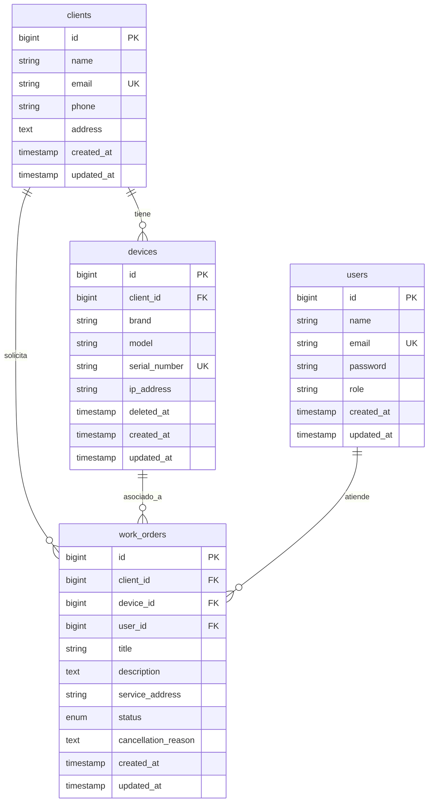

# NOC Lite - Gestor de Mantenimiento de Redes

Plataforma de soporte técnico para el registro, asignación y seguimiento de órdenes de trabajo en equipos de red.

## 🛠 Instalación (Herd & DBngin)
1. Clona este repositorio en el directorio raíz de Laravel Herd (ej. `~/Herd`).
2. Abre la terminal en el proyecto y ejecuta: `composer install` y `npm install && npm run build`.
3. Crea tu base de datos local llamada `noclite` usando DBngin (MySQL).
4. Configura tu `.env` (credenciales de DBngin y `MAIL_MAILER=log` o tus credenciales de Mailtrap).
5. Ejecuta migraciones y seeders: `php artisan migrate:fresh --seed`.
6. Accede en el navegador a: `http://noclite.test`.

## 🔑 Credenciales de Prueba
**Administrador:**
- Email: `admin@noclite.test`
- Password: `password`

**Ingeniero:**
- Email: `alan@noclite.test` (o `ada@noclite.test`)
- Password: `password`

## 📊 Arquitectura (DER)

A continuación se muestra el modelo de Entidad-Relación de la base de datos de NOC Lite:

### Detalle de Tablas:
- `users`: Gestiona la autenticación y el rol del personal (`role`: admin/engineer).
- `clients`: Clientes a los que se les presta servicio de mantenimiento.
- `devices`: Inventario de red (`client_id` FK). Posee *SoftDeletes* para evitar perder el historial operativo cuando se desactiva un equipo.
- `work_orders`: Tabla transaccional núcleo. Cruza al Cliente (`client_id`), Equipo (`device_id`) y al Ingeniero asignado (`user_id`). Su cambio de estado dispara eventos automatizados (Observers y Jobs).
